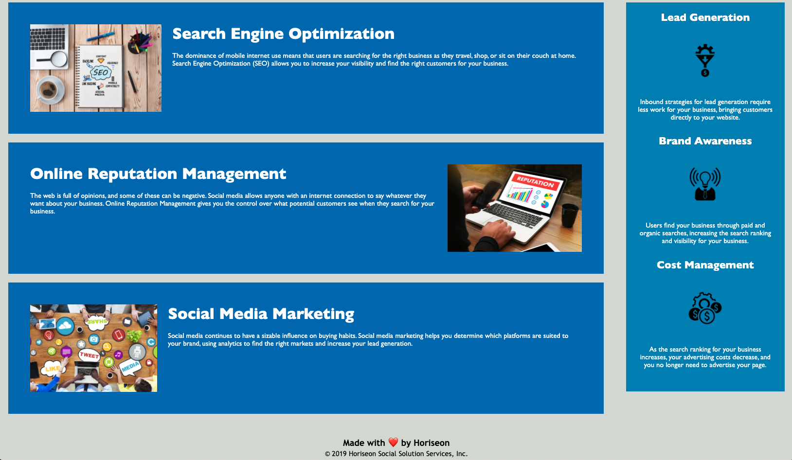

# Code Refactor
I took existing code and refactored to meet specific criteria and to make it more accesible. As a developer, I want to meet accessibility standards so that our site is optimized for search engines. 

 > Technologies Used: HTM, CSS


## Website Snapshot
#




## Improvements Made:
1. Ensured links function correctly
2. Cleaned up CSS to make more efficient
3. Consolidated CSS selectors and properties
4. Organiged CSS to follow Semantic stucture of the HTML elements
5. Included comments throughout

## Code Snippet 
#
- Includes comments that show changes and create structure
- Shows semantic HTML elements that show logical structure
- Added accessability features

```
<!-- ************************ -->
<!-- ******* Content ******** -->
<!-- ************************ -->

<!-- CHANGED: div for article  -->
<article class="content">
    <!-- REMOVED: class="search-engine-optimization" -->
    <!-- ADDED: class="content-box" -->
    <div class="content-box">

        <!-- ADDED: alt tag -->
        

        <h2>Search Engine Optimization</h2>

        <p>
            The dominance of mobile internet use means that users are 
            searching for the right business as they travel, shop, 
            or sit on their couch at home. 
            Search Engine Optimization (SEO) allows you to increase 
            your visibility and find the right customers for your 
            business.
        </p>
    </div>

```

## Author 
#
Nadine Bundschuh

[LinkedIn](https://www.linkedin.com/in/nadine-bundschuh-731233b9)
|
[GitHub](https://github.com/nadineb1160)

